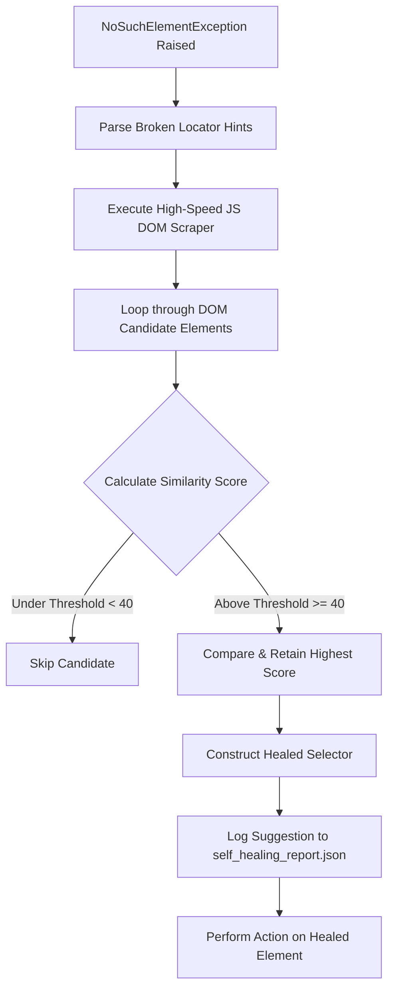

# Locator Healing Patterns & Algorithm Specification

This document details the runtime self-healing and element-discovery patterns executed by the `SelfHealingLibrary.py` component of the **Flaky Test and Self-Healing** skill.

---

## 1. Algorithmic Matching Strategy

When an interaction keyword (like `Smart Click` or `Smart Input Text`) fails due to a missing locator (`NoSuchElementException`), the self-healing algorithm activates. The healing mechanism leverages a multi-tiered heuristic scoring matrix to find the closest element in the active DOM matching the original intent.



---

## 2. In-Browser DOM Scraper

To prevent massive latency spikes, the self-healing engine does **not** query individual elements sequentially via JSON-WP/W3C protocol. Instead, it executes a single, atomic, in-browser JavaScript query that extracts all interactive elements and their key attributes at once:

```javascript
const candidates = [];
const elements = document.querySelectorAll(
    "button, input, a, select, [role], [data-testid], [data-qa], [automation-id], [aria-label]"
);
for (let i = 0; i < elements.length; i++) {
    const el = elements[i];
    candidates.push({
        tag: el.tagName.toLowerCase(),
        id: el.getAttribute("id") || "",
        testid: el.getAttribute("data-testid") || el.getAttribute("data-qa") || el.getAttribute("automation-id") || "",
        aria_label: el.getAttribute("aria-label") || "",
        role: el.getAttribute("role") || "",
        text: el.innerText || el.textContent || el.value || "",
        classes: el.className || "",
        outerHTML: el.outerHTML.substring(0, 300)
    });
}
return JSON.stringify(candidates);
```

---

## 3. Heuristic Scoring Weights

Candidates are graded on a 0-100+ scale based on the **Test Locator Standard** priorities:

| Attribute Type | Matching Condition | Score Weight | Description |
| :--- | :--- | :--- | :--- |
| **Custom QA Test ID** | Exact match on `data-testid` / `data-qa` / `automation-id` | **+100.0** | Top priority selector. Safest for automation. |
| **Custom QA Test ID** | Partial/substring match on test ID attributes | **+50.0** | High likelihood match (e.g. `submit-btn` vs `checkout-submit-btn`). |
| **Static Element ID** | Exact match on `id` attribute (excluding dynamic patterns) | **+80.0** | Reliable HTML element ID. |
| **Static Element ID** | Partial match on static HTML ID | **+30.0** | Good indicator of related element structure. |
| **Aria Label** | Exact match on `aria-label` accessibility tag | **+70.0** | Critical indicator of business intent. |
| **Visible Text** | Exact match on visible tag text (whitespace trimmed, case-insensitive) | **+60.0** | Extremely useful for action buttons and links. |
| **Visible Text** | Partial match on visible tag text | **+30.0** | Good fallback for dynamic buttons. |
| **Element Tag** | Tag name matches the original locator tag (e.g., `button` to `button`) | **+10.0** | Boosts matching accuracy for same tag types. |

---

## 4. Anti-Pattern Filtering (Dynamic IDs)

Dynamic framework-generated IDs (e.g., from React, Angular, Kendo UI) act as "poison" for test stability, changing on every render. The scoring engine filters these out to prevent healing toward dynamic dead-ends:
- **Filtering Rules**: Any ID containing the Kendo prefix (`k-`), standard framework indicators (`kendo-`, `_uuid_`), or long consecutive sequences of digits (e.g., `id="button-982173"`) is disqualified or heavily penalized.
- **Verification Logic**:
  ```python
  # Regex to detect dynamic numeric sequences or framework ID patterns
  if re.search(r'\d{5,}', candidate_id) or "kendo" in candidate_id.lower():
      # Ignore ID matching, rely purely on accessibility attributes
  ```

---

## 5. Report Structure

Every single self-healing action is logged to `./self_healing_report.json` with an `"Suggested"` state. Developers must review this report to update their source files, turning dynamic runtime healing into permanent code stability.

*Example event:*
```json
[
  {
    "timestamp": "2026-05-29 17:15:30",
    "url": "https://staging.freelancer-platform.com/list",
    "original_locator": "xpath=//div[3]/span/button",
    "healed_locator": "[data-testid='filter-apply-btn']",
    "healing_type": "Locator Healing",
    "context_html_snippet": "<button class=\"btn primary-btn\" data-testid=\"filter-apply-btn\">Apply Filters</button>",
    "status": "Suggested",
    "action_required": "Update locator from 'xpath=//div[3]/span/button' to '[data-testid=\"filter-apply-btn\"]' in accordance with Test Locator Standard."
  }
]
```
